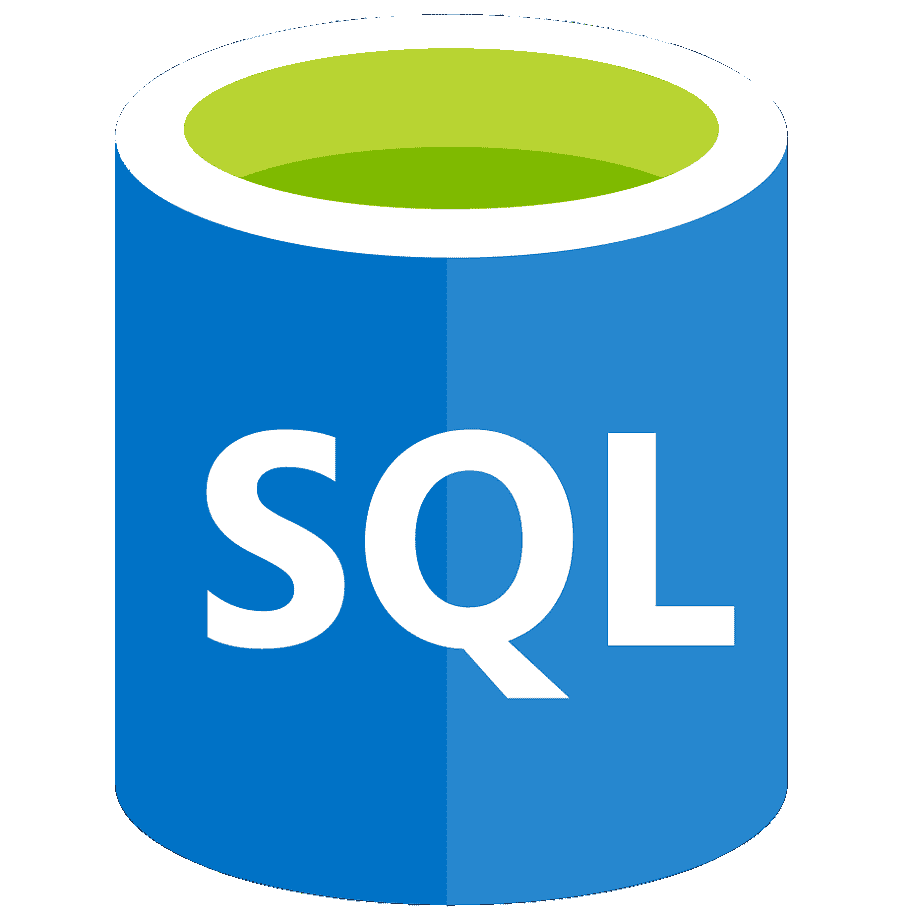
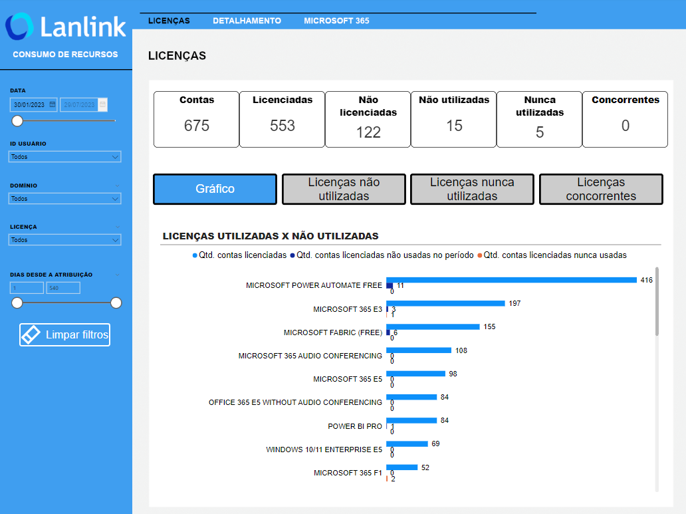

<h1 align="left">Hello world, I'm Daniel 👋</h1>
<h2 align="left">Business intelligence specialist Microsoft PL-300 certified Data analysis instructor</h2>
<h3 align="left">About me:</h3>

- 🧑‍💼 Currently working as a Data Analyst Manager.
- ✏️ Currently working with **SQL, Python, Excel and Power BI.**
- 🏠 Currently living and working in Brazil.
- 👨‍🏫 I enjoy teaching Data Analysis.
- 🤓 Studying to became Data Scientist.
- 📫 Reach me at **daniel.lucena@proton.me**.
- 📄 Know about my experiences on my [Linkedin page](https://www.linkedin.com/in/danlucena/).

<h3 align="left">Talk to me on:</h3>

<h3 align="left">Languages:</h3>

<h3 align="left">Tools:</h3>

## Portfolio and main projects
### Office 365 Resource Consumption

Resource consumption report made for Lanlink Informática client to identify the consumption of resources offered for the client's Microsoft licenses.

**Technologies used: Power BI, Excel.**

This report is used to track the usage of features offered by Microsoft licenses in order to diagnose the need to reassign the user's license to another or simply change licenses to reduce organizational costs.

The report's interactive features are based on the use of buttons that allow users to navigate between pages in a way similar to browsing the internet, and to switch between views using bookmarks.

The business problems that the report helps to solve are:

- Lack of tracking of the usage of each tool's capabilities that each license provides.
- Users may have more than one license and these may have common features.
- Difficulty exporting data from their system and manipulating informations in spreadsheets.
- Segmentation of information by license, tenant domain, and user ID.

**Client data was anonymized in compliance with the Brazilian LGPD standard.**

<a href="https://github.com/odaniellucena/ConsumoRecursosO365/tree/main" target="_blank">Click here</a> to acess the Github repo.
  

### Web scraping of companies dividend payments and financial metrics

If you invest your money in the stock market, you already know how important it is to know about financial metrics and dividend values historically paid by companies. This information is very important for making decisions about what to do with that specific asset. Many companies offer the possibility of downloading this information (even if not all of it is shown on the asset page) in spreadsheet format, but others may charge a fee to do so. If you don't want to pay, you can simply copy and paste. The questions are:

- Are you willing to copy and paste data from hundreds of sources?
- You know that this data changes every month, right?

What if we automate this task? The scripts provided are purely written in Python and perform the task of extracting data from the main websites.

**Technologies used: Python.**

<a href="https://github.com/odaniellucena/WebScraping_Finances" target="_blank">Click here</a> to acess the Github repo.
   

###  Data correction report - Federal Government of Brazil

Development of a data correction report for the Brazilian Federal Comptroller General's Office, designed to provides information on penalties applied to public agents, as well as companies and entities. It is possible to find data on expulsions by agency or year, number of reinstatements, general details on administrative disciplinary processes, and sanctions against individuals and legal entities.

**Technologies used: Power BI, SQL, GIMP.**

Results:
- Improved quality of public data.
- Reduced errors and irregularities.
- Increased transparency and accountability in public management.

<a href="https://centralpaineis.cgu.gov.br/visualizar/corregedorias" target="_blank">Click here</a> to acess the report.
      

###   Public integrity report - Federal Government of Brazil

Development of a public integrity report for the Brazilian Federal Comptroller General's Office, designed to allows users to access information on the structuring, execution, and monitoring of integrity programs in federal government agencies and entities (ministries, autonomous agencies, and public foundations).

The information is provided for each phase of action presented in the panel, as well as the respective data dictionaries describing each column.

**Technologies used: Power BI, SQL, Excel, GIMP.**

Results:
- Improved transparency and accountability in public management.
- Identifying potential risks and vulnerabilities in public institutions.
- Providing recommendations to prevent corruption and promote the integrity of public institutions.
- Promotion of a culture of integrity and transparency in public management.

<a href="https://centralpaineis.cgu.gov.br/visualizar/integridadepublica" target="_blank">Click here</a> to acess the report.
  
<!-- 

&nbsp;

-->

